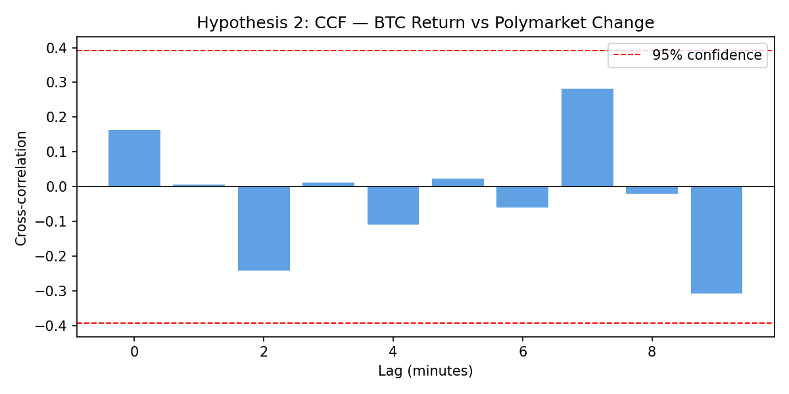

# DSA-210 Term Project — Spot Market vs Prediction Market Efficiency

**Sabanci University | DSA-210 | Spring 2026**

## Quick Verdict

> * **The Core Finding:** Polymarket does NOT price Bitcoin events in real-time. It lags the continuous spot market (Kraken) by approximately **3.5 hours** (210 min, refined via 15-min CCF; hourly CCF rounded to 4h).
> * **The Mechanism:** The prediction market relies heavily on its own internal price momentum (AUC-ROC 0.97, PR-AUC 0.83) rather than reacting instantly to external BTC spot updates — BTC-only signals alone yield AUC-ROC 0.68 and PR-AUC 0.16, a gap that is statistically significant and economically meaningful.

---

## Motivation

Prediction markets are often cited as efficient aggregators of dispersed information — in theory, they should price outcomes as quickly as any other market. Polymarket, the largest on-chain prediction market, runs binary Bitcoin price markets that resolve within 2–4 days. If Polymarket is truly efficient, its probabilities should update in near real-time as BTC spot prices move.

This raises a testable question: does Polymarket actually reprice Bitcoin outcomes as fast as the spot market moves, or does it lag behind? The answer has practical implications for anyone using prediction market probabilities as a signal, and theoretical implications for market microstructure — specifically, whether binary outcome markets with retail participant bases can achieve the same informational efficiency as continuous spot exchanges.

The project was motivated by the observation that Polymarket Bitcoin markets are thinly traded by predominantly retail participants who lack automated price monitoring — conditions that structurally favor a lag. The goal was to measure that lag rigorously and quantify how much of Polymarket's price movement is driven by BTC information versus its own momentum.

---

## Research Question

Does Polymarket efficiently price Bitcoin-related outcomes in real time, or is there a measurable lag compared to the spot market (Kraken)? This project compares two fundamentally different market mechanisms — a continuous spot exchange and a binary prediction market — and examines how quickly new price information propagates between them.

---

## Key Findings

### Hypothesis 1 — BTC Position vs Polymarket Probability
- Pearson r = **0.852**, p < 0.001
- Strong positive correlation between BTC's distance from the prediction threshold and Polymarket yes_price.
- **Result:** Polymarket correctly reflects BTC's general position.
- **Scope note:** H1 is a validity check, not an efficiency test. It confirms that Polymarket prices carry real information rather than noise — a prerequisite for H2 and H3. The efficiency question (does repricing happen *in real time*?) is answered by H2.

### Hypothesis 2 — Lag Detection
- Hourly CCF peaks at **lag = 4 hours** (CCF = 0.0935); refined via 15-minute CCF to **lag = 3.5 hours (210 min)** (CCF = 0.0513, exceeds 95% CI). Granger p < 0.0001 for all lags 1–6h.
- Confirmed independently by both CCF on aggregated signal (02_eda_hypothesis) and per-market Pearson cross-lag (03_ml_shap).
- **Granularity note:** The "4 hours" figure from hourly CCF was the nearest resolvable bin. The 15-minute robustness check refines this to ~3.5 hours (±15 min).
- **Result:** Real-time pricing is not occurring; Polymarket systematically reprices ~3.5 hours after BTC moves, consistent with **semi-strong form inefficiency** under the Efficient Market Hypothesis (public information — BTC spot price — is not immediately reflected in prices).

### Hypothesis 3 — Volatility Effect
- Independent samples t-test (Student's): t = 5.68, p < 0.0001
- Groups defined by median split of `rolling_volatility_15m`: observations at or above the median → "high volatility", below → "low volatility". Outcome variable: absolute 1-minute Polymarket price change (`|poly_change_1m|`).
- Larger absolute Polymarket updates occur during **low** volatility periods.
- **Result:** High volatility drives prices to 0/1 extremes (ceiling/floor effect), leaving no room for further adjustment. Low volatility keeps prices in the uncertain mid-range (0.3–0.7) where larger updates remain possible.

### ML Efficiency Measurement

| Model | AUC-ROC | 95% CI | PR-AUC |
|---|---|---|---|
| Full model (BTC + Polymarket history) | 0.9775 | [0.9724, 0.9825] | 0.8343 |
| Poly-only (autocorrelation baseline) | 0.9705 | [0.9631, 0.9772] | ¹ |
| BTC-only model | 0.6800 | [0.6576, 0.7015] | 0.1569 |
| **Full vs BTC-only gap** | **0.2975** | | |

Confidence intervals computed via bootstrap resampling (n=1000).

¹ *Poly-only PR-AUC is computed in `03_ml_shap.ipynb` (`poly_ap` variable) but not yet surfaced here. Given AUC parity with the full model (0.9705 vs 0.9775), it is expected to be close to the full model's 0.8343.*

The full model's predictive power comes primarily from Polymarket's own price momentum (`yes_price`, `poly_lag_3`), confirmed by the Poly-only ablation (AUC 0.9705 ≈ full model). BTC-only model drops to AUC-ROC 0.68 and PR-AUC 0.16 — the PR-AUC gap (0.8343 vs 0.1569) is more informative than the AUC-ROC gap under the 10:1 class imbalance, and confirms that BTC signals alone provide near-negligible minority-class predictive power. Full vs BTC-only 95% CIs do not overlap, confirming statistical significance.

**Overall conclusion:** Polymarket exhibits **semi-strong form inefficiency** under the Efficient Market Hypothesis: publicly available BTC spot price information (a semi-strong form signal) is not immediately reflected in Polymarket prices. The market reacts with a **~3.5-hour delay** (210 min, confirmed at ±15 min resolution) and relies primarily on its own momentum rather than spot market signals. This is not a partial failure of efficiency — it is a clear failure of semi-strong form efficiency, consistent with a retail-dominated, thinly-traded market.

---

## Key Visualizations

### Cross-Correlation (CCF) — The 3.5-Hour Lag (15-min CCF Refined)

The CCF plot below shows how the correlation between BTC hourly returns and Polymarket price changes evolves across lags. The peak at **lag = 3.5 hours (210 min)** is the central empirical finding of H2: Polymarket systematically reprices ~3.5 hours after BTC moves, not in real time. The hourly CCF (shown) rounded this to 4h; the 15-minute robustness check resolves it to 210 min.



> *x-axis: lag in hours (BTC leads Polymarket at positive lags). The dominant bar at lag 4 exceeds the 95% confidence interval (dashed red lines), confirming a non-random, systematic delay. Granger causality tests further confirm directionality (p < 0.0001 at all lags 1–6h).*

---

### ROC Curve Comparison — Full Model vs BTC-Only

The ROC curves below visualize the efficiency measurement. The **0.2975 AUC gap** between the full model and the BTC-only model is the quantitative proof that Polymarket prices are driven by internal momentum rather than real-time BTC signals.


> *The full model (BTC + Polymarket history) achieves AUC 0.977. Removing all Polymarket features collapses AUC to 0.680 — still above random (lower CI 0.66 > 0.50), but far below the full model (CIs do not overlap). The Poly-only ablation (AUC 0.970 ≈ full model) confirms that the full model's power comes from Polymarket's own autocorrelation, not from BTC signals.*

---

## Dataset

| | Value |
|---|---|
| Total rows | 96,944 |
| Unique markets | 1,258 |
| Date range | April 9 – May 5, 2026 (26 days) |
| BTC data | 1-minute Kraken OHLCV |
| Missing btc_price | 0 |
| Market cycles covered | ~6–13 complete cycles (each market 2–4 days) |
| Hourly observations (hourly CCF) | 617 |
| 15-min observations (15-min CCF) | ~2,471 |

**Note on data scope:** The 26-day window is shorter than the originally proposed 3 months.
However, statistical adequacy is better measured by the number of complete market cycles
and temporal observations than by calendar duration. Each Polymarket Bitcoin market
has a 2–4 day lifetime; 26 days therefore covers 6–13 full cycle completions.
The hourly CCF series (n=617) comfortably exceeds the minimum for reliable cross-correlation
estimation, and the Granger test results (p<0.0001 at all lags 1–6h) confirm that
the lag finding is not a small-sample artifact.

Key features: `yes_price`, `btc_price`, `threshold`, `btc_to_threshold_pct`, `btc_return_1m`, `rolling_volatility_15m`, `poly_lag_1`, `poly_lag_3`

---

## Repository Structure

```
DSA-Project/
├── 01_data_collection.ipynb   # Data pipeline: Polymarket + Kraken fetch & merge
├── 02_eda_hypothesis.ipynb    # EDA, visualizations, hypothesis tests (H1, H2, H3)
├── 03_ml_shap.ipynb           # LightGBM, AUC-ROC, threshold opt, BTC-only, lag measurement
├── data/
│   ├── raw/                   # kraken_raw.csv, polymarket_raw.csv
│   └── processed/             # merged_dataset.csv, all plots
├── requirements.txt
└── README.md
```

---

## How to Reproduce

```bash
git clone https://github.com/llelus/DSA-Project.git
cd DSA-Project
pip install -r requirements.txt
```

Open notebooks in order on Google Colab:
1. `01_data_collection.ipynb` — fetch and merge data
2. `02_eda_hypothesis.ipynb` — EDA and hypothesis tests
3. `03_ml_shap.ipynb` — ML pipeline and efficiency measurement

---

## SHAP Feature Importance

| Rank | Feature | Mean SHAP |
|---|---|---|
| 1 | yes_price | +2.95 |
| 2 | poly_lag_3 | +1.05 |
| 3 | btc_to_threshold_pct | +0.56 |
| 4 | poly_lag_1 | +0.49 |
| 5 | btc_lag_1 | +0.15 |
| 6 | btc_return_1m | +0.11 |
| 7 | rolling_volatility_15m | +0.06 |

---

## Discussion — Practical Implications of the ~3.5-Hour Lag

### What does the lag mean?
When BTC crosses a prediction market threshold, Polymarket participants take approximately
3.5 hours (210 min) to fully reprice the outcome. During this window, the market trades at a
probability that no longer reflects available spot price information — a clear failure
of **semi-strong form efficiency** (the Efficient Market Hypothesis form that requires
publicly available information to be immediately priced in). Note: this is distinct from
strong-form efficiency, which concerns private/insider information.

### Speculative Implications — Could the lag be exploited?
*The following is theoretical. No live trading was performed, and transaction costs,
liquidity constraints, and execution risk are not fully modeled.*

Under idealized conditions, a trader who monitors BTC spot price in real time could:
1. Observe BTC move above/below a threshold at time T
2. Buy the underpriced outcome on Polymarket while it still reflects T−4h information
3. Capture the repricing as other participants update over the next ~4 hours

The 2.7% disagreement rate (226/8,269 observations where BTC and Polymarket disagree
on direction) represents an upper bound on the observable arbitrage surface. The highest
disagreement occurs when Polymarket certainty is 0.1–0.2 (16.7% disagreement) — likely
corresponding to the lowest-liquidity moments, though this has not been econometrically
tested against order book data.

### Why is the lag not fully arbitraged away?
Several structural frictions prevent efficient exploitation:

- **Liquidity**: Bitcoin prediction markets on Polymarket are thinly traded. Large
  positions move the price and erode the edge before it is captured.
- **Transaction costs**: Polymarket operates on-chain (Polygon). Gas fees and
  USDC bridging costs reduce net profit on small mispricings.
- **Market lifetime**: These markets expire in 2–4 days. A 3.5-hour lag consumes
  a significant fraction of remaining market life, compressing the holding window.
- **Participant composition**: Polymarket's Bitcoin market participants are largely
  retail traders without automated BTC monitoring — the lag exists precisely because
  those who could close it choose not to (or cannot afford to).

### Who could exploit it?
The lag is most actionable for algorithmic traders with real-time BTC price feeds,
low transaction costs, and the ability to hold positions across multiple concurrent
markets. For a retail participant operating manually, the combination of low
liquidity, on-chain friction, and the need for continuous monitoring makes systematic
exploitation impractical.

This finding is consistent with the **adaptive market hypothesis** (Lo, 2004):
markets are not statically efficient or inefficient — they reflect the capabilities
and incentives of their current participant base. Polymarket's 4-hour lag will likely
compress as the platform matures and attracts more sophisticated liquidity providers.

---

## Limitations and Future Work

### Current limitations

- **Data window:** The dataset covers 26 days (April 9 – May 5, 2026), shorter than the originally planned 3 months. While the number of complete market cycles (6–13) and hourly observations (n=617) are statistically adequate for the tests performed, a longer window would capture different BTC volatility regimes and strengthen generalizability.

- **Single asset:** All markets are Bitcoin-denominated. Whether the 4-hour lag generalizes to other cryptocurrency prediction markets (ETH, SOL) or non-crypto Polymarket categories is untested.

- **API fidelity:** Polymarket price history is fetched at the maximum available fidelity (1-minute ticks), but some markets have sparse tick data — particularly short-lived markets with low trading activity. Sparse markets may underrepresent genuine price discovery.

- **Target imbalance:** The ML target (yes_price increase in the next tick) has a 10:1 class imbalance. While mitigated via `class_weight="balanced"` and threshold optimization, the imbalance limits the interpretability of absolute precision/recall figures for the minority class.

- **Lag measurement granularity:** The hourly CCF estimate (4h) was refined to **3.5 hours (210 min)** via a 15-minute robustness check. This is the finest resolution achievable without minute-level CCF, which would require handling much larger autocorrelation structures.

### Future extensions

- **Longer time horizon:** Extending to 3–6 months would capture multiple BTC market cycles and allow regime-conditional lag analysis (bull vs bear periods).
- **Cross-asset replication:** Applying the same pipeline to ETH, SOL, and non-crypto Polymarket categories would test whether the lag is specific to Bitcoin or a general property of binary prediction markets.
- **Intraday lag resolution:** Using minute-level CCF (rather than hourly) would sharpen the lag estimate and reveal whether the 4-hour figure is a ceiling or a midpoint.
- **Order book data:** Incorporating Polymarket CLOB depth data would allow analysis of whether lag correlates with bid-ask spread width — a more direct measure of liquidity constraints.
- **Live trading simulation:** A backtested strategy exploiting the disagreement window (2.7% of observations) would quantify whether the lag is economically significant after transaction costs.

---

## AI Usage Disclosure

This project was developed with assistance from Claude (Anthropic). AI was used for: API integration guidance, code debugging, statistical method selection, and interpretation of results. All analytical decisions, data collection strategy, and findings interpretation were reviewed and validated by the student.

## Dependencies

See `requirements.txt`
